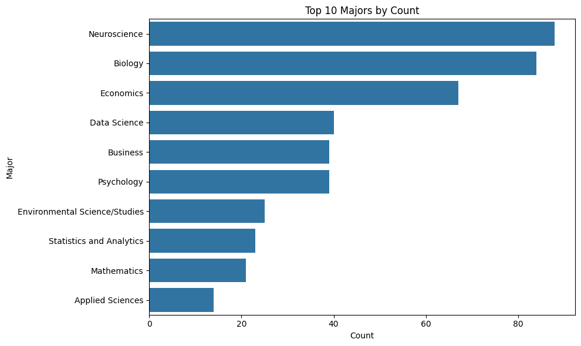
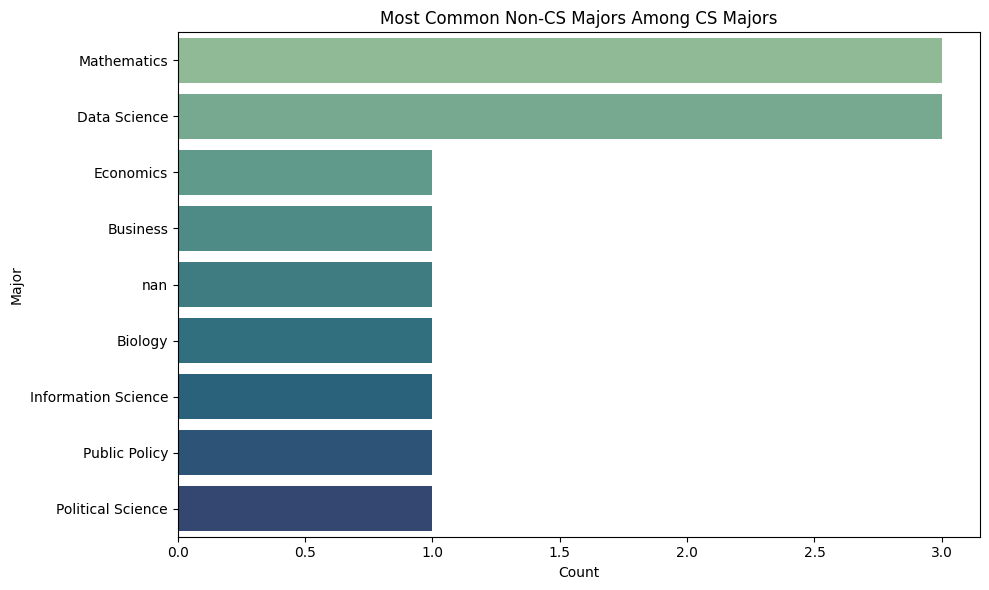
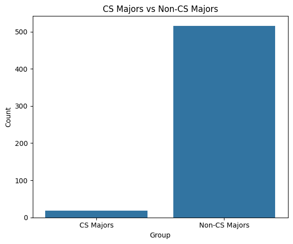

---
# Do not edit the text between these lines!
layout: default
---

# The Question
Are students who are taking COMP110 most likely going to use what is taught or should the cirriculum change to more practical use of python for data science.

# Method
There was a self completed survey done by the current students in COMP110 where they filled out if they are doing Computer science as a major and then what major their primary major is.

# Results

This graph shows the most common majors for people currently taking COMP110

This shows how many CS majors there are compared to non-CS majors currently in COMP110

This shows the Major count if the person selected Yes to a major in Computer Science but then put down a different major as their primary.

# Conclusion
Just by looking at it, most individuals who are in comp110 are not computer science majors. The most common majors being stem based likely indicates that most people are taking this class to learn how to work programming languages potentially for the use of data analysis. This could indicate that we should change the cirriculum to focus more on practical application of python programming for the purposes of data analysis rather than what we currently teach. This is officially a computer science program so it might be more worth diverting more students to a different class such as STOR120 or DATA110 rather than taking COMP110. This should require further study to see if COMP110 is actually serving the intended purpose of why people wanted to take this class, what they wanted to get out of it, and if they took it as a part of their major pathway then if the outcome of the class is what the intended purpose of the pathway was.